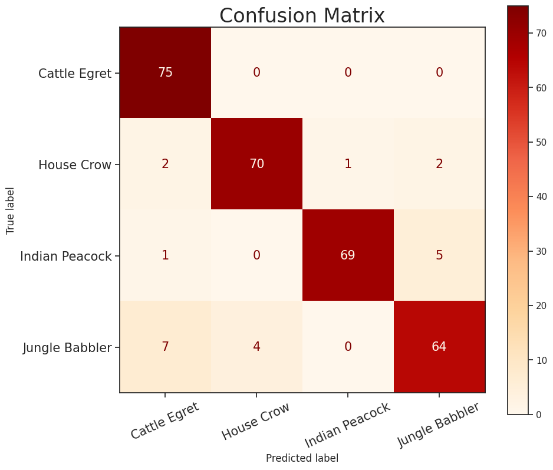
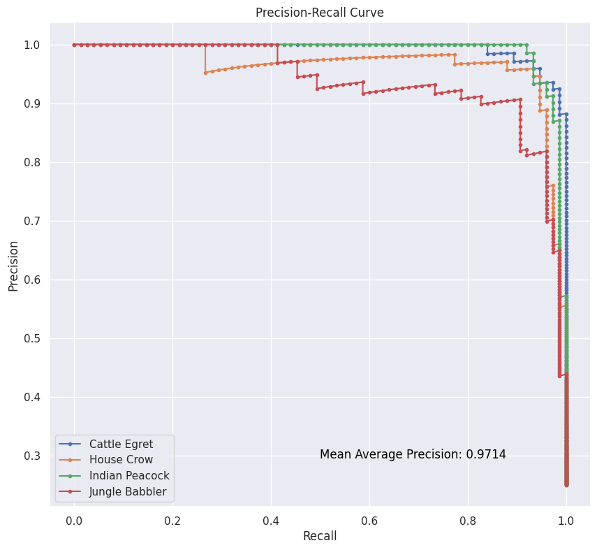
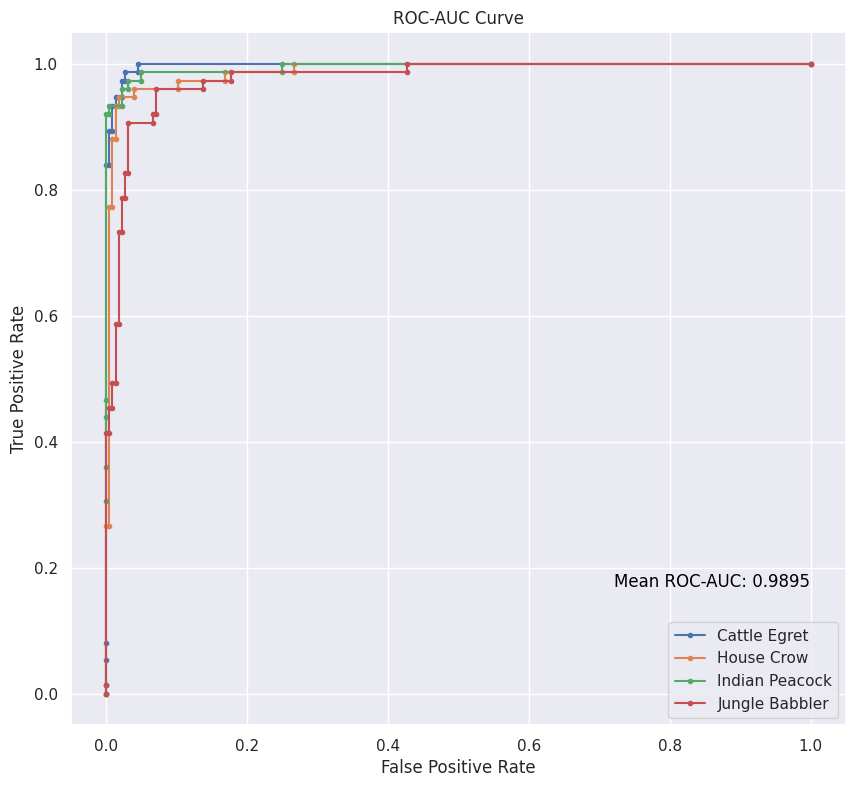

# ResNet-Implementation

 
 

This repository contains an implementation of the ResNet (Residual Network) architecture using Tensorflow. ResNet is a deep neural network architecture that introduced the concept of residual learning to address the vanishing gradient problem in very deep networks. It has been highly successful in various computer vision tasks, such as image classification and object detection (here, we implemented this for image classification).

## What is ResNet?

ResNet is a type of convolutional neural network (CNN) proposed by Kaiming He et al. in their paper "Deep Residual Learning for Image Recognition" (2015). It introduces residual blocks that allow layers to learn residual mappings, making it easier to train deeper networks. This architecture has significantly improved the performance and convergence of deep neural networks.

## Features

* Implementation of the ResNet architecture from scratch using TensorFlow
* Pre-trained ResNet models for various image classification tasks.   [`resnet-50.h5`](https://www.dropbox.com/scl/fi/habw23oyiqeolk3x6skqc/best_model.h5?rlkey=tfgshoc914qh9aijnstc9yfch&dl=0)
* Easy-to-use API for training, testing, and evaluating the ResNet model.
* Code to visualize and analyze model performance using the confusion matrix, Precision-Recall, and ROC-AUC curves.

## Matrics

The accuracy of our model (i.e., ResNet-50) on Testing Data (which contains 75 images belonging to 4 classes each) is **92.667%** over 100 epochs.

### Confusion Matrix

### Precision-Recall Curve

Mean Average Precision (mAP) is **0.9714**

### ROC-AUC Curve

Mean ROC-AUC Score is **0.9895**

